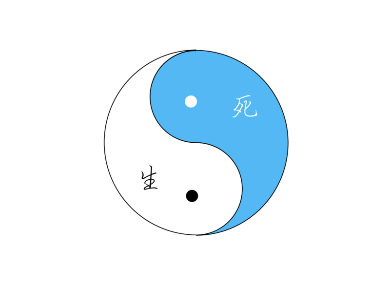
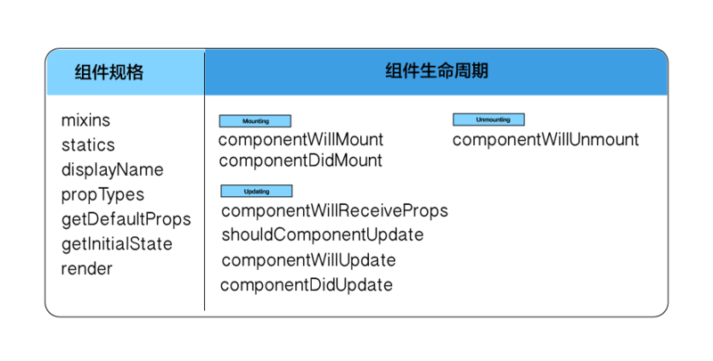
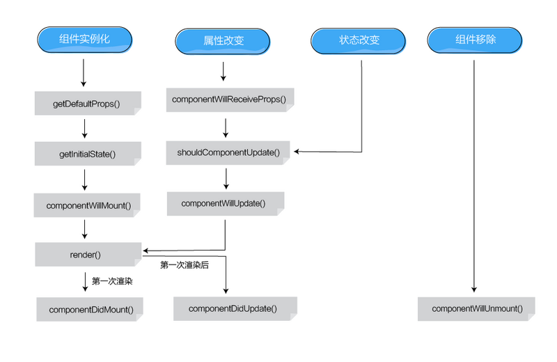
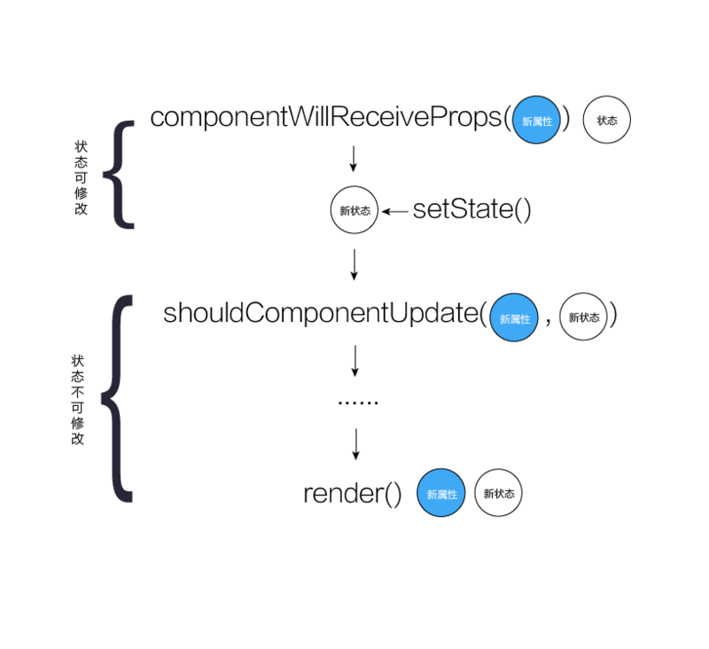

# 1.4 React 组件生命周期



> [官方文档](http://facebook.github.io/react/docs/component-specs.html)

## 1.4.1 组件

React 中组件有自己的生命周期方法，简单理解可以为组件从 **出生（实例化） ->  激活 -> 销毁** 生命周期 hook。通过这些 hook 方法可以自定义组件的特性。 除此之外，还可以设置一些额外的规格配置。



这些生命周期方法都可以在调用 **React.createClass** 的参数对象中传入， 我们已经使用过了一些方法：

- render
- getInitialState
- getDefaultProps
- propTypes
  
 
## 1.4.2 mixins 

**类型：** `array mixins`

mixins 可以理解为 React 的插件列表，通过这种模式在不同组件之间共享方法数据或者行为只需共享 mixin 就行，mixins 内定义的生命周期方法在组件的生命周期内都会被调用。

可能的一些疑问：

- Q1. 如果组件已经定义了某个生命周期方法， mixin 内也定义了该方法，那么 mixin 内会被调用还是 组件的会被调用？
- Q2. 多个插件都定义了相同生命周期的方法呢？ 
- Q3. 那如果多个插件定义了 getInitialState 这种配置方法呢，有何影响？

插件模式并非继承的模式，对于问题 1、2 的答案是一样的，都会被调用，调用顺序为 mixins 数组中的顺序。

- A1: 都会被调用
- A2: 都会被调用
- A3: React 会对返回结果做智能的合并，所有插件的 getInitialState 都会生效，前提条件是它们返回的字段不冲突，如果发生字段冲突，React 会提示报错。 同理如果是非 组件的规格方法，出于共享目的的一些方法在多个 mixin 中也不能冲突。

eg：

```javascript
var MyMixin1 = {
    componentDidMount: function() {
        console.log('auto do something when component did mount');
    }
};

var MyMixin2 = {
    someMethod: function() {
        console.log('doSomething');
    }
};

var MyComponnet = React.createClass({
    mixins: [MyMixin1, MyMixin2],
    componentDidMount: function() {
        // 调用 mixin1 共享的方法
        this.someMethod();
    }
});
```


## 1.4.3 statics 

**类型：** `object statics`

statics 可以定义组件的类方法

eg:
```html
var MyComponent = React.createClass({
  statics: {
    customMethod: function(foo) {
      return foo === 'bar';
    }
  }
});

MyComponent.customMethod('bar');  // true
```

React 的组件是 OOP 的思维，MyComponent 是一个 class，class  分为类方法和实例方法，实例方法可以访问 this, 然而类方法不能，所以我们不能在 Class 中返回状态或者属性。 

## 1.4.4 displayName

**类型：** `string displayName`

为了显示调试信息，每个组件都会有一个名称，JSX 在转为 JS 的时候自动的设置 displayName, 如下：

```js
// Input (JSX):
var MyComponent = React.createClass({ });

// Output (JS):
var MyComponent = React.createClass({displayName: "MyComponent", });
```

当然我们也可以自定义 displayName 

## 1.4.5 生命周期方法

下图描述了整个组件的生命周期，包含的主要几种情况：

1. 组件被实例化的时候
2. 组件属性改变的时候
3. 组件状态被改变的时候
4. 组件被销毁的时候




### 1.4.5.1 getDefaultProps

object getDefaultProps()

执行过一次后，被创建的类会有缓存，映射的值会存在this.props,前提是这个prop不是父组件指定的 

这个方法在对象被创建之前执行，因此不能在方法内调用this.props ，另外，注意任何getDefaultProps()返回的对象在实例中共享，不是复制。


### 1.4.5.2 getInitialState

object getInitialState()

控件加载之前执行，返回值会被用于state的初始化值

### 1.4.5.3 componentWillMount

```javascript
void componentWillMount()
```

**条件**：第一次渲染阶段在调用 render 方法前会被调用
**作用**：该方法在整个组件生命周期只会被调用一次，所以可以利用该方法做一些组件内部的初始化工作

执行一次，在初始化render之前执行，如果在这个方法内调用setState，render()知道state发生变化，并且只执行一次


### 1.4.5.4 render

ReactElement render()

render的时候会调用render()会被调用 

调用render()方法时，首先检查this.props和this.state返回一个子元素，子元素可以是DOM组件或者其他自定义复合控件的虚拟实现 

如果不想渲染可以返回null或者false，这种场景下，React渲染一个<noscript>标签，当返回null或者false时，ReactDOM.findDOMNode(this)返回null 

render()方法是很纯净的，这就意味着不要在这个方法里初始化组件的state，每次执行时返回相同的值，不会读写DOM或者与服务器交互，如果必须如服务器交互，在componentDidMount()方法中实现或者其他生命周期的方法中实现，保持render()方法纯净使得服务器更准确，组件更简单。


### 1.4.5.5 componentDidMount

```javascript
void componentDidMount()
```

**条件**：第一次渲染成功过后，组件对应的 DOM 已经添加到页面后调用
**作用**：这个阶段表示组件对应的 DOM 已经存在，我们可以在这个时候做一些依赖 DOM 的操作或者其他的一些如请求数据，和第三方库整合的操作。如果嵌套了子组件，子组件会比父组件优先渲染，所以这个时候可以获取子组件对应的 DOM。

在初始化render之后只执行一次，在这个方法内，可以访问任何组件，componentDidMount()方法中的子组件在父组件之前执行

从这个函数开始，就可以和 JS 其他框架交互了，例如设置计时 setTimeout 或者 setInterval，或者发起网络请求

### 1.4.5.6 componentWillReceiveProps(newProps)

```javascript
void componentWillReceiveProps(
  object nextProps
)
```

**条件：** 当组件获取新属性的时候，第一次渲染不会调用
**用处：** 这个时候可以根据新的属性来修改组件状态 
eg:
```javascript
    componentWillReceiveProps: function(nextProps) {
      this.setState({
        likesIncreasing: nextProps.likeCount > this.props.likeCount
      });
    }
```
**注意：** 这个时候虽说是获取新属性，但并不能确定属性一定改变了，例如一个组件被多次渲染到 DOM 中，如下面：

```html
    var Component = React.createClass({
        componentWillReceiveProps: function(nextProps) {
            console.log('componentWillReceiveProps', nextProps.data.bar);
        },
        rener: function() {
            return <div> {this.props.data.bar} </div>
        }
    });

    var container = document.getElementById('container');
    var mydata = {bar: 'drinks'};
    ReactDOM.render(<Component data={mydata} />, container);
    ReactDOM.render(<Component data={mydata} />, container);
    ReactDOM.render(<Component data={mydata} />, container);
```

结果会输出两次 componentWillReceiveProps，虽然属性数据没有改变，但是仍然会调用  componentWillReceiveProps 方法。

当props发生变化时执行，初始化render时不执行，在这个回调函数里面，你可以根据属性的变化，通过调用this.setState()来更新你的组件状态，旧的属性还是可以通过this.props来获取,这里调用更新状态是安全的，并不会触发额外的render调用

> 参考 Facebook [(A=>B) => (B => A)](http://facebook.github.io/react/blog/2016/01/08/A-implies-B-does-not-imply-B-implies-A.html)

### 1.4.5.7 shouldComponentUpdate(nextProps, nextState)

```javascript
boolean shouldComponentUpdate(
  object nextProps, object nextState
)
```

**条件：** 接收到新属性或者新状态的时候在 render 前会被调用（除了调用 forceUpdate 和初始化渲染以外）
**用处：** 该方法让我们有机会决定是否重渲染组件，如果返回 false，那么不会重渲染组件，借此可以优化应用性能（在组件很多的情况）。

这个方法在初始化render时不会执行，当props或者state发生变化时执行，并且是在render之前，当新的props或者state不需要更新组件时，返回false

当shouldComponentUpdate方法返回false时，讲不会执行render()方法，componentWillUpdate和componentDidUpdate方法也不会被调用

默认情况下，shouldComponentUpdate方法返回true防止state快速变化时的问题，但是如果·state不变，props只读，可以直接覆盖shouldComponentUpdate用于比较props和state的变化，决定UI是否更新，当组件比较多时，使用这个方法能有效提高应用性能


### 1.4.5.8 componentWillUpdate

```javascript
void componentWillUpdate(
  object nextProps, object nextState
)
```

**条件**：当组件确定要更新，在 render 之前调用
**用处**：这个时候可以确定一定会更新组件，可以执行更新前的操作
**注意**：方法中不能使用 setState ，setState 的操作应该在 componentWillReceiveProps 方法中调用。

当props和state发生变化时执行，并且在render方法之前执行，当然初始化render时不执行该方法，需要特别注意的是，在这个函数里面，你就不能使用this.setState来修改状态。这个函数调用之后，就会把nextProps和nextState分别设置到this.props和this.state中。紧接着这个函数，就会调用render()来更新界面了

### 1.4.5.9 componentDidUpdate

```javascript
void componentDidUpdate(
  object prevProps, object prevState
)
```

**条件**：更新被应用到 DOM 之后（组件更新结束之后执行，在初始化render时不执行）
**用处**：可以执行组件更新过后的操作

### 1.4.5.10 componentWillUnmount

void componentWillUnmount()

当组件要被从界面上移除的时候，就会调用componentWillUnmount(),在这个函数中，可以做一些组件相关的清理工作，例如取消计时器、网络请求等。

## 1.4.6 生命周期与单向数据流

我们知道 React 的核心模式是单向数据流，这不仅仅是对于组件级别的模式，在组件内部 的生命周期中也是应该符合单向数据的模式。数据从组件的属性流入，再结合组件的状态，流入生命周期方法，直到渲染结束这都应该是一个单向的过程，其间不能随意改变组件的状态。 




## 1.4.7总结


React 生命周期就介绍完了，其中最上面的虚线框和右下角的虚线框的方法一定会执行，左下角的方法根据props state是否变化去执行，其中建议只有在componentWillMount,componentDidMount,componentWillReceiveProps方法中可以修改state值。

